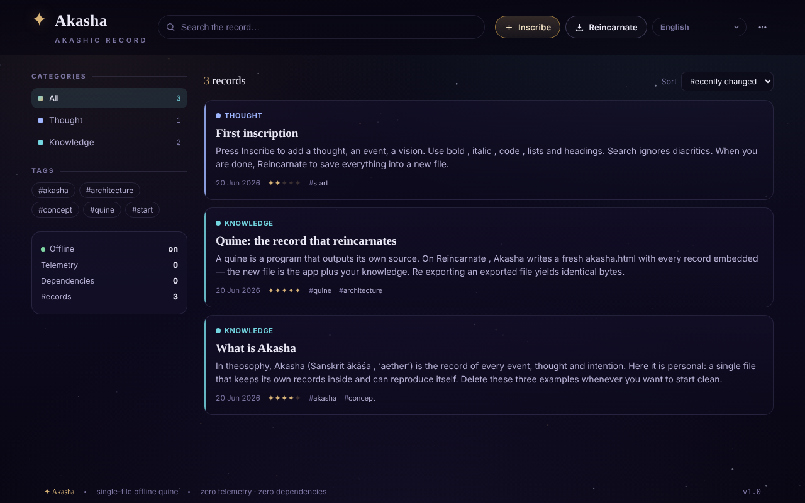

# Akasha

Registru akashic offline: un quine HTML dintr-un singur fișier, care se reîncarnează cu toate înregistrările încorporate.

**Live:** https://chiuta.github.io/Akasha/

## Ce este

Akasha este un registru personal de înregistrări (gânduri, evenimente, cunoaștere, amintiri, viziuni, întrebări) într-un singur fișier `index.html`. Este un *quine*: când apăsați „Reîncarnează", aplicația scrie o copie nouă a ei însăși (`akasha.html`) cu toate înregistrările curente încorporate în fișier. Noul fișier este aplicația plus datele dumneavoastră.

## Funcții

- Înregistrări cu titlu, categorie (Gând, Eveniment, Cunoaștere, Amintire, Viziune, Întrebare), „rezonanță", etichete și conținut cu formatare simplă (`**aldin**`, `*cursiv*`, `` `cod` ``, liste, titluri).
- Căutare, filtrare după categorii și etichete, sortare (Modificat recent, Creat recent, Rezonanță, Alfabetic).
- Editare, duplicare și ștergere de înregistrări; meniu cu „Arhivă" și „Statistici" (înregistrări, cuvinte, etichete unice, zile acoperite, defalcare pe categorii).
- „Vezi propriul cod": afișează sursa completă pe care aplicația o scrie la reîncarnare (copiere sau descărcare).
- „Verifică integritatea": verifică proprietatea de fix-point (reexport cu octeți identici), prezența unică a blocului de date și reîncărcarea tuturor înregistrărilor.
- „Exportă JSON" și „Importă (JSON / .html)".
- Fundal cu stele, care poate fi pornit/oprit.
- Salvare automată de siguranță în browser, cu banner „Restaurează / Ignoră" pentru modificări mai noi decât fișierul; avertisment la închidere dacă există modificări nesalvate.
- Interfață în 58 de limbi (inclusiv română), cu suport pentru scriere de la dreapta la stânga (ar, he, fa, ur).

## Manual de utilizare

1. Deschideți `index.html` în browser.
2. Apăsați „Inscripționează" (sau tasta `N`), completați titlul, categoria, rezonanța, etichetele și conținutul, apoi „Salvează".
3. Căutați cu câmpul de căutare (tasta `/`) sau filtrați din panoul „Categorii" / „Etichete"; schimbați ordinea din „Ordonează".
4. Deschideți o înregistrare pentru a o edita, duplica sau șterge.
5. **Pentru a păstra datele:** apăsați „Reîncarnează" (`Ctrl+S` / `Cmd+S`). Browserul descarcă `akasha.html`; deschideți acel fișier data viitoare, deoarece conține toate înregistrările.
6. Pentru copii de siguranță: meniul „Exportă JSON"; pentru a încărca date: „Importă (JSON / .html)".
7. Pentru limbă, folosiți selectorul de limbă din interfață (eticheta „Limbă").
8. Alte scurtături: `Esc` închide dialogul sau meniul; scurtăturile cu o singură tastă (`N`, `/`) sunt dezactivate în timp ce scrieți într-un câmp.

## Confidențialitate și rețea

- Aplicația nu conține apeluri de rețea (nu are `fetch`, CDN-uri sau resurse externe) și nu contactează niciun host terț.
- Datele sunt păstrate în blocul de date din interiorul fișierului HTML (sursa de adevăr). În plus, `localStorage` conține o copie de siguranță automată (cheia `akasha:autosave:v1`), ștearsă după reîncarnare.
- Nu există analitice; aplicația însăși afișează „Telemetrie: 0" și „Dependențe: 0".

## Rulare locală / offline

Descărcați `index.html` și deschideți-l direct din sistemul de fișiere (`file://`), fără server. Nu necesită internet.

## Licență

Licența nu este încă declarată explicit în acest repository; vezi nota din aplicație.

## Autor

Alexio — Alexandru-Ionuț Chiuță. Contact: alexio@trom.tf

## English summary

Akasha is a single-file offline "akashic record": a quine that, on "Reincarnate" (Ctrl/Cmd+S), writes a fresh copy of itself with all records embedded. It has search, tags, categories, JSON import/export, an integrity check, and a UI in 58 languages. It makes no network requests; an autosave backup is kept in localStorage.
